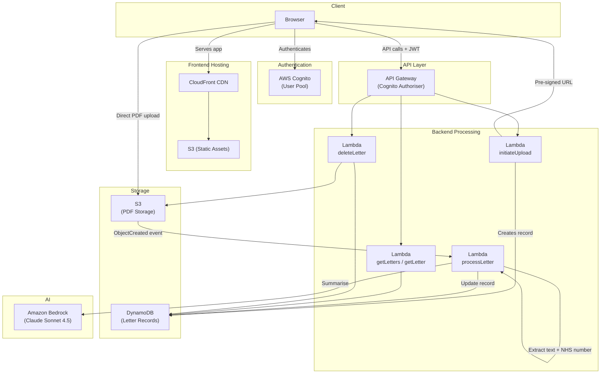
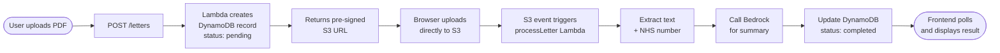

# Architecture Diagram

## System Components

```mermaid
flowchart TB
    subgraph Client["Client"]
        Browser
    end

    subgraph Auth["Authentication"]
        Cognito["AWS Cognito\n(User Pool)"]
    end

    subgraph Frontend["Frontend Hosting"]
        CF["CloudFront CDN"]
        S3F["S3 (Static Assets)"]
        CF --> S3F
    end

    subgraph API["API Layer"]
        APIGW["API Gateway\n(Cognito Authoriser)"]
    end

    subgraph Processing["Backend Processing"]
        L1["Lambda\ninitiateUpload"]
        L2["Lambda\nprocessLetter"]
        L3["Lambda\ngetLetters / getLetter"]
        L4["Lambda\ndeleteLetter"]
    end

    subgraph Storage["Storage"]
        S3P["S3\n(PDF Storage)"]
        DB["DynamoDB\n(Letter Records)"]
    end

    subgraph LLM["AI"]
        Bedrock["Amazon Bedrock\n(Claude Sonnet 4.5)"]
    end

    Browser -->|"Serves app"| CF
    Browser -->|"Authenticates"| Cognito
    Browser -->|"API calls + JWT"| APIGW
    APIGW --> L1
    APIGW --> L3
    APIGW --> L4
    L1 -->|"Creates record"| DB
    L1 -->|"Pre-signed URL"| Browser
    Browser -->|"Direct PDF upload"| S3P
    S3P -->|"ObjectCreated event"| L2
    L2 -->|"Extract text + NHS number"| L2
    L2 -->|"Summarise"| Bedrock
    L2 -->|"Update record"| DB
    L3 --> DB
    L4 --> DB
    L4 --> S3P
```

## Upload & Processing Flow

```mermaid
flowchart LR
    A([User uploads PDF]) --> B[POST /letters]
    B --> C[Lambda creates\nDynamoDB record\nstatus: pending]
    C --> D[Returns pre-signed\nS3 URL]
    D --> E[Browser uploads\ndirectly to S3]
    E --> F[S3 event triggers\nprocessLetter Lambda]
    F --> G[Extract text\n+ NHS number]
    G --> H[Call Bedrock\nfor summary]
    H --> I[Update DynamoDB\nstatus: completed]
    I --> J([Frontend polls\nand displays result])
```
