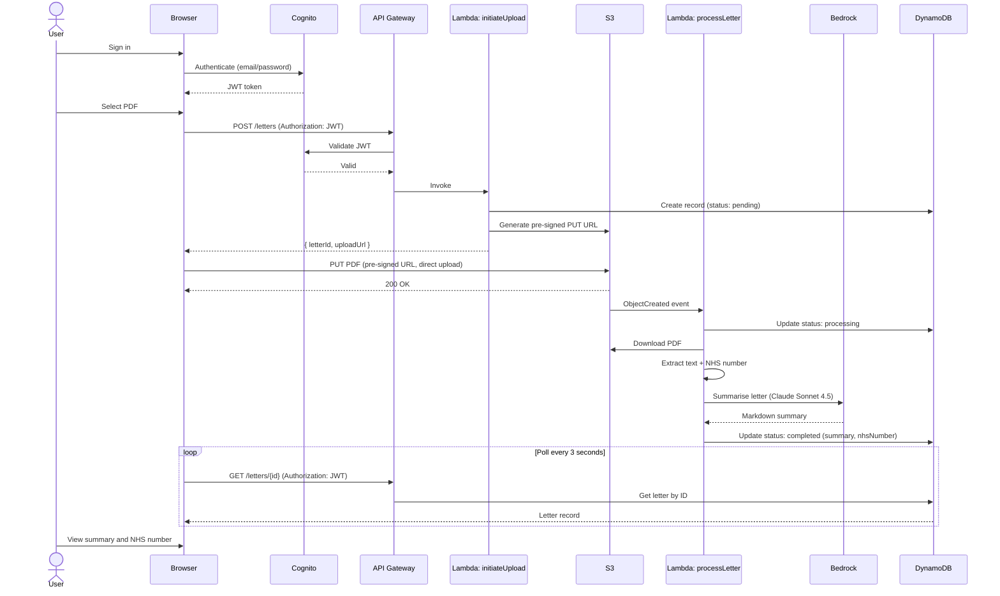

# Architecture Diagram

```mermaid
sequenceDiagram
    actor User
    participant Browser
    participant Cognito
    participant APIGateway as API Gateway
    participant InitiateUpload as Lambda: initiateUpload
    participant S3
    participant ProcessLetter as Lambda: processLetter
    participant Bedrock
    participant DynamoDB

    User->>Browser: Sign in
    Browser->>Cognito: Authenticate (email/password)
    Cognito-->>Browser: JWT token

    User->>Browser: Select PDF
    Browser->>APIGateway: POST /letters (Authorization: JWT)
    APIGateway->>Cognito: Validate JWT
    Cognito-->>APIGateway: Valid
    APIGateway->>InitiateUpload: Invoke
    InitiateUpload->>DynamoDB: Create record (status: pending)
    InitiateUpload->>S3: Generate pre-signed PUT URL
    InitiateUpload-->>Browser: { letterId, uploadUrl }

    Browser->>S3: PUT PDF (pre-signed URL, direct upload)
    S3-->>Browser: 200 OK

    S3->>ProcessLetter: ObjectCreated event
    ProcessLetter->>DynamoDB: Update status: processing
    ProcessLetter->>S3: Download PDF
    ProcessLetter->>ProcessLetter: Extract text + NHS number
    ProcessLetter->>Bedrock: Summarise letter (Claude Sonnet 4.5)
    Bedrock-->>ProcessLetter: Markdown summary
    ProcessLetter->>DynamoDB: Update status: completed (summary, nhsNumber)

    loop Poll every 3 seconds
        Browser->>APIGateway: GET /letters/{id} (Authorization: JWT)
        APIGateway->>DynamoDB: Get letter by ID
        DynamoDB-->>Browser: Letter record
    end

    User->>Browser: View summary and NHS number
```
